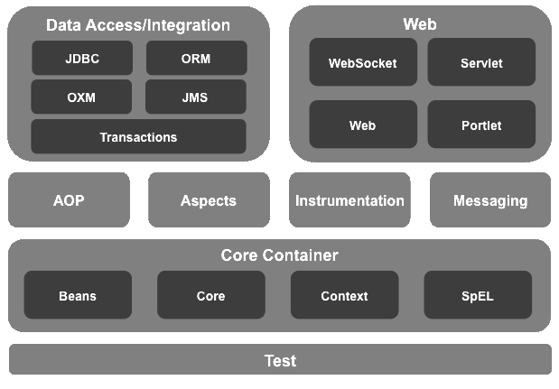

<link rel="stylesheet" href="https://zhmhbest.gitee.io/hellomathematics/style/index.css">

# [Spring](../index.html)

[TOC]

## Spring Framework

[**Spring Framework**](https://repo.spring.io/release/org/springframework/spring/)

### 控制反转（Inversion of Control, IOC）

通过**XML配置**、**工厂模式**和**反射**等技术，把对象创建和调用过程交给Spring进行管理，以降低耦合度。

### 面向切面编程（Aspect Oriented Programming, AOP）

交叉业务的编程问题即为面向切面编程。AOP的目标就是使交叉业务模块化。

## IOC

### 属性注入

- [`demoAttributeInjection.java`](../src/main/java/ioc/demoAttributeInjection.java)
- [`demoAttributeInjection.xml`](../src/main/resources/ioc/demoAttributeInjection.xml)

### 特殊符号、Object注入

- [`demoSpecialInjection.java`](../src/main/java/ioc/demoSpecialInjection.java)
- [`demoSpecialInjection.xml`](../src/main/resources/ioc/demoSpecialInjection.xml)

### Collection、Map注入

- [`demoCollectionInject.java`](../src/main/java/ioc/demoCollectionInject.java)
- [`demoCollectionInject.xml`](../src/main/resources/ioc/demoCollectionInject.xml)

### 自动注入

- [`demoAutoInject.java`](../src/main/java/ioc/demoAutoInject.java)
- [`demoAutoInject.xml`](../src/main/resources/ioc/demoAutoInject.xml)

### 工厂方法

- [`demoFactory.java`](../src/main/java/ioc/demoFactory.java)
- [`demoFactory.xml`](../src/main/resources/ioc/demoFactory.xml)

### 生命周期

- [`demoLifeCycle.java`](../src/main/java/ioc/demoLifeCycle.java)
- [`demoLifeCycle.xml`](../src/main/resources/ioc/demoLifeCycle.xml)

### 注解方法

- [`demoAnnotation.java`](../src/main/java/ioc/demoAnnotation.java)
- [`demoAnnotation.xml`](../src/main/resources/ioc/demoAnnotation.xml)

### 无配置注解方法

- [`demoAnnotationNoXml.java`](../src/main/java/ioc/demoAnnotationNoXml.java)

## AOP

### 基本概念

#### 连接点

可以被增强的方法。

#### 切入点

实际被增强的方法。

#### 通知

增强的逻辑部分，常见的有

- 前置通知：`@Before`
- 返回通知：`@After`
- 环绕通知：`@Around`
- 最终通知：`@AfterReturning`
- 异常通知：`@AfterThrowing`

#### 切面

把通知应用到切入点的过程。

### 实现方式

- 有接口使用`JDK`动态代理；
- 没有接口使用`CGLIB`动态代理（在子类中增强父类方法）。

## [SpringWeb](./web/index.html)
