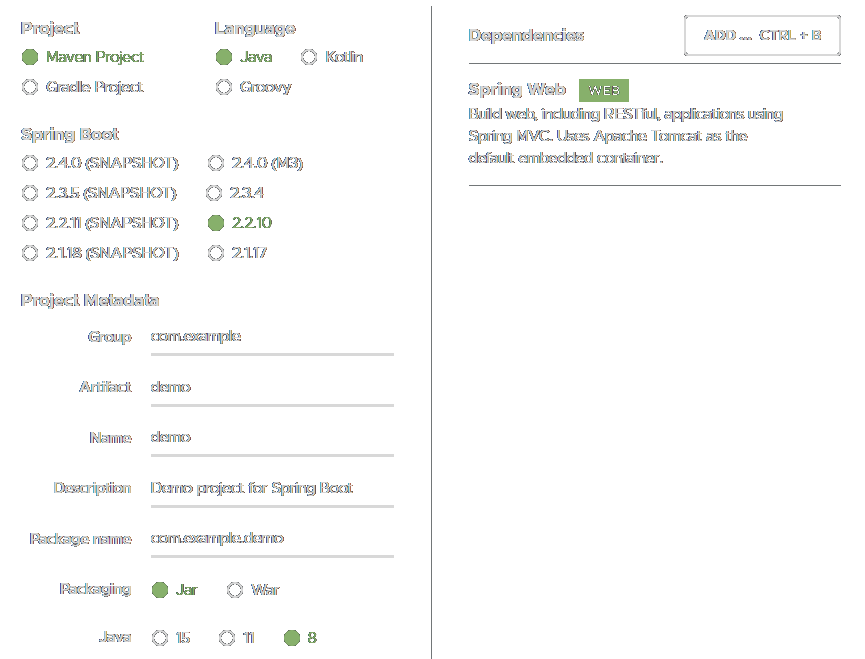

<link rel="stylesheet" href="https://zhmhbest.gitee.io/hellomathematics/style/index.css">
<script src="https://zhmhbest.gitee.io/hellomathematics/style/index.js"></script>

# [SpringWeb](../index.html)

[TOC]

## SpringMVC

### Create

```bash
# HelloSpringMVC
ProjectName=HelloSpringMVC
mvn archetype:generate "-DgroupId=org.example" "-DartifactId=${ProjectName}" "-DarchetypeArtifactId=maven-archetype-webapp" "-DinteractiveMode=false"
cd ${ProjectName}
mkdir "src/main/java"
mkdir "src/main/webapp/WEB-INF/pages"
```

### Dependencies

`pom.xml`

@import "pom.xml"

### Controller

`src/main/java/org/example/HelloController.java`

@import "src/main/java/org/example/HelloController.java"

### ContextConfig

`src/main/resources/springmvc.xml`

@import "src/main/resources/springmvc.xml"

### WebConfig

`src/main/webapp/WEB-INF/web.xml`

@import "src/main/webapp/WEB-INF/web.xml"

### Pages

`src/main/webapp/index.jsp`

@import "src/main/webapp/index.jsp" {as="html"}

`src/main/webapp/WEB-INF/pages/hello.jsp`

@import "src/main/webapp/WEB-INF/pages/hello.jsp" {as="html"}

`src/main/webapp/WEB-INF/pages/void.jsp`

@import "src/main/webapp/WEB-INF/pages/void.jsp" {as="html"}

## SpringBoot

登录[Spring Initializr](https://start.spring.io/)下载一个项目模板。



`src/main/java/com/example/demo/controller/HelloController.java`

```java
package com.example.demo.controller;

import org.springframework.web.bind.annotation.GetMapping;
import org.springframework.web.bind.annotation.PostMapping;
import org.springframework.web.bind.annotation.RestController;

import javax.servlet.http.HttpServletRequest;
import javax.servlet.http.HttpServletResponse;

@RestController
public class HelloController {

    @GetMapping("/hello")
    public String getHello(HttpServletRequest request, HttpServletResponse response) {
        System.out.println(request.getHeader("User-Agent"));
        response.setHeader("MyHeader", "Get");
        return "Hello";
    }

    @PostMapping("/hello")
    public String postHello(HttpServletRequest request, HttpServletResponse response) {
        System.out.println(request.getHeader("User-Agent"));
        response.setHeader("MyHeader", "Post");
        return "Hello";
    }

}
```

```batch
mvn package
start http://127.0.0.1:8080/hello
@FOR /F "usebackq" %f in (`DIR /B "target\*.war"`) DO java -jar "target/%f"
```
